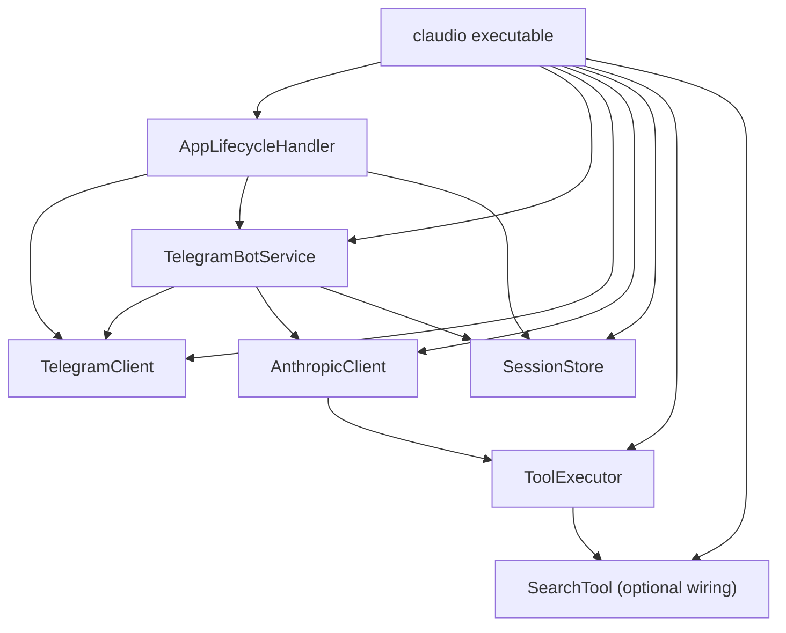

# Claudio Architecture

## Overview

`claudio` is a Vapor-based Telegram bot that:

1. Long-polls Telegram for new updates.
2. Filters incoming messages by an allowlist of Telegram `chat.id` values.
3. Builds a text prompt from persisted per-chat history.
4. Calls Anthropic with tool-use support.
5. Sends the final response back to Telegram.
6. Persists chat history and the polling cursor on disk.

The executable target in `Sources/claudio` remains intentionally thin: it owns startup/configuration, environment wiring, and lifecycle registration. Runtime behavior lives in local packages.

## Module Boundaries

### Root executable (`claudio`)

- Files: `Sources/claudio/*`
- Responsibilities:
  - Startup/shutdown (`entrypoint.swift`)
  - Environment loading and dependency wiring (`configure.swift`)
  - System prompt loading/validation (`SystemPromptLoader`)
  - Store service witnesses in `Application.storage`
  - Register `AppLifecycleHandler` for polling runtime
  - HTTP routes (currently empty)

### `AppLifecycleHandler`

- Files: `AppLifecycleHandler/Sources/AppLifecycleHandler/*`
- Responsibilities:
  - Parse/validate `ALLOWED_TELEGRAM_CHAT_IDS`
  - Start polling loop on boot
  - Resume from persisted cursor (`lastProcessedUpdateID`)
  - Ignore non-text, bot-originated, and unauthorized chat messages
  - Dispatch authorized text messages to `TelegramBotService`
  - Persist cursor after each processed update (including failed handling)
  - Retry polling request failures with backoff
  - Cancel polling task and flush sessions on shutdown

### `TelegramBotService`

- File: `TelegramBotService/Sources/TelegramBotService/TelegramBotService.swift`
- Responsibilities:
  - Append incoming user message to session history
  - Build prompt from last 20 persisted messages
  - Call `AnthropicClient.respond`
  - Send generated reply to Telegram
  - Append assistant reply only after successful send

### `AnthropicClient`

- Files: `AnthropicClient/Sources/AnthropicClient/*`
- Responsibilities:
  - Wrap Anthropic Messages API interaction
  - Resolve API model from `AnthropicModel`
  - Execute tool-use loops (up to 6 rounds)
  - Validate required tool inputs (required keys, string type checks)
  - Return final text response
- Depends on:
  - `SwiftAnthropic`
  - `ToolExecutor`

Note: `AnthropicClient` no longer reads `SOUL.md` directly. The app layer injects prompt content via `systemPrompt`.

### `ToolExecutor`

- Files: `ToolExecutor/Sources/ToolExecutor/*`
- Responsibilities:
  - Execute shell commands (`run_command`) with timeout
  - Read files (`read_file`)
  - Write files (`write_file`)
  - Execute web search (`web_search`) when `SearchTool` is configured
  - Define the tool catalog/schema exposed to Anthropic
  - Surface typed per-tool errors
- Current state:
  - `web_search` is always present in the advertised tool catalog.
  - If no search client is injected, `web_search` fails with `webSearchNotConfigured`.

### `SearchTool`

- Files: `SearchTool/Sources/SearchTool/*`
- Responsibilities:
  - Provider-agnostic search client wrapper
  - Current live implementation targets Brave Search API
  - Request construction, response decoding, and transport/status mapping
- Current state:
  - Wired into `ToolExecutor.live(searchTool:)` only when `WEB_SEARCH_API_KEY` is set.

### `TelegramClient`

- Files: `TelegramClient/Sources/TelegramClient/*`
- Responsibilities:
  - Telegram Bot API transport (`getUpdates`, `sendMessage`)
  - Payload models and API error mapping

### `SessionStore`

- Files: `SessionStore/Sources/SessionStore/*`
- Responsibilities:
  - Persist per-chat transcript JSONL files
  - Persist polling cursor JSON
  - Recreate session directory on writes if removed
  - Flush file handles on shutdown

## Dependency Graph

## Runtime Flow

1. `Entrypoint.main` creates a Vapor `Application`, runs `configure(_:)`, then `app.execute()`.
2. `configure(_:)`:
   - loads `.env`
   - constructs `SessionStore.live(...)`
   - constructs `TelegramClient.live(...)` (requires `TELEGRAM_BOT_TOKEN`)
   - constructs `ToolExecutor.live(...)`:
     - default `ToolExecutor.live()` when `WEB_SEARCH_API_KEY` is missing
     - injects `SearchTool.live(apiKey:)` when `WEB_SEARCH_API_KEY` is present
   - loads `SOUL.md` via `SystemPromptLoader.load()` (must exist and be non-empty)
   - constructs `AnthropicClient.live(...)` (requires `ANTHROPIC_API_KEY`, receives loaded prompt and configured `ToolExecutor`)
   - constructs `TelegramBotService.live(...)`
   - constructs/registers `AppLifecycleHandler` (requires `ALLOWED_TELEGRAM_CHAT_IDS`)
3. On boot, `AppLifecycleHandler.didBootAsync`:
   - loads last cursor from `SessionStore`
   - starts long-polling loop via `getUpdates(offset, timeout)`
4. For each update:
   - ignore updates without `message`
   - ignore bot-authored messages
   - ignore empty text
   - ignore chats not in allowlist
   - call `TelegramBotService.handleIncomingText(chatID, text)`
   - advance/persist cursor regardless of handling success (avoids poison-message replay loops)
5. `TelegramBotService.handleIncomingText`:
   - append user message to session file
   - load session and build prompt from latest 20 messages (`User:` / `Assistant:` lines + trailing `Assistant:`)
   - call `AnthropicClient.respond`
   - send reply via `TelegramClient.sendMessage`
   - append assistant reply to session file
6. `AnthropicClient.respond`:
   - sends message to Anthropic with system prompt and full tool catalog
   - if Anthropic requests tool use, validates input and executes tools via `ToolExecutor`
   - appends `tool_result` blocks (`isError: true` when execution fails), then re-queries Anthropic
   - truncates long tool output before returning results to Anthropic
   - repeats until final text is returned or max tool rounds is reached
7. On shutdown, lifecycle handler cancels polling task and flushes `SessionStore`.

## Persistence Model

Storage root: `./.sessions` (relative to app working directory).

- Transcript per chat: `<chatID>.jsonl`
  - one JSON object per line
  - schema fields: `schemaVersion`, `role`, `text`, `timestamp`
  - loader skips malformed/unsupported records
- Polling cursor: `polling_cursor.json`
  - fields: `schemaVersion`, `lastProcessedUpdateID`

This provides conversation and polling continuity across restarts.

## Concurrency Model

- Service modules mostly use closure-based witness structs marked `Sendable`.
- Polling task lifecycle is isolated in actor `PollingTaskState`.
- `AppLifecycleHandler` is `@unchecked Sendable`, with mutable task state isolated in that actor.
- Polling retries use async sleep (`Task.sleep`) with configurable delay.

## Configuration

Required environment variables:

- `TELEGRAM_BOT_TOKEN`
- `ALLOWED_TELEGRAM_CHAT_IDS`
- `ANTHROPIC_API_KEY`

Optional environment variables:

- `ANTHROPIC_MODEL` (`opus` | `sonnet` | `haiku`, default: `sonnet`)
- `ANTHROPIC_MAX_TOKENS` (default: `1024`, must be `> 0`)
- `WEB_SEARCH_API_KEY` (enables live `web_search` execution via Brave Search API)

Required file:

- `SOUL.md` in the working directory
  - must exist
  - must be non-empty (after trimming whitespace)
  - startup fails if missing/empty/unreadable

## Error Handling

- Startup/configuration:
  - missing required env values fail fast (`fatalError`)
  - missing/empty/unreadable `SOUL.md` throws `SystemPromptLoaderError` during configure
- Polling:
  - polling request failures are logged and retried
  - cursor persistence failures are logged and polling continues
- Message handling:
  - per-update processing failures are logged
  - update is still acknowledged by cursor advancement
- Anthropic tool-use:
  - unsupported tools or invalid tool input shape are treated as tool execution errors
  - tool execution failures are returned to Anthropic as `tool_result` with `isError: true`
  - generation continues within the tool loop unless max rounds are exceeded
- Package-typed errors include:
  - `TelegramClientError`
  - `AnthropicClientError`
  - `SessionStoreError`
  - `ToolExecutorError`
  - `SearchToolError`
  - `SystemPromptLoaderError` (root app)

## Testing Coverage

- Root app:
  - unknown route returns 404
  - `SystemPromptLoader` happy path + missing/empty file failures
- `TelegramClient`:
  - request encoding, response decoding, API error mapping
- `SessionStore`:
  - append/load round-trip, malformed line tolerance, cursor persistence, directory recreation, flush
- `TelegramBotService`:
  - happy path, history inclusion, Anthropic failure, Telegram send failure
- `AppLifecycleHandler`:
  - allowlist parsing/filtering
  - resume from cursor and cursor persistence
  - processing failure continuation
  - shutdown flush behavior
- `AnthropicClient`:
  - request construction
  - response text handling
  - tool-call round-trips
  - support for every advertised tool
- `ToolExecutor`:
  - run/read/write behavior and error mapping
  - `web_search` configured/unconfigured paths, error wrapping, and JSON serialization behavior
- `SearchTool`:
  - request building, result decoding, non-HTTP response handling, and non-2xx mapping

## Constraints and Known Gaps

- Polling-only bot operation (no webhook mode).
- No application HTTP routes beyond default 404.
- Prompt format is plain role-prefixed text, not structured conversation objects.
- Tool execution has no sandboxing or explicit command allowlist.
- `web_search` is advertised to Anthropic even when `WEB_SEARCH_API_KEY` is unset; calls then fail at runtime with tool error text.
- Repository still contains legacy `TelegramPollingLifecycleHandler/` and `Sources/claudio/Keys/Application+TelegramPollingTask.swift`, which are not part of current runtime wiring.
