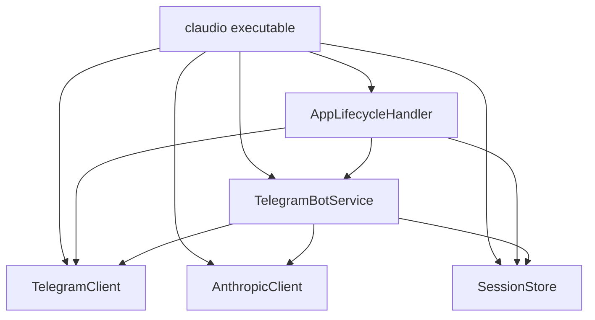
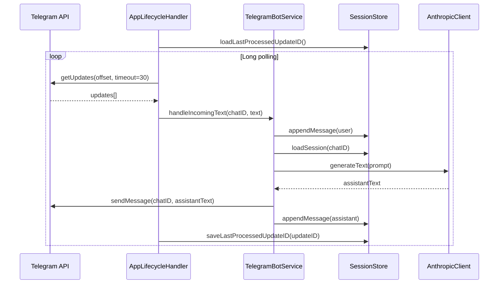

# Claudio Architecture

## Overview

`claudio` is a Vapor-based Telegram bot service that:

1. Polls Telegram for new text messages.
2. Builds a prompt from per-chat conversation history.
3. Generates a response via Anthropic.
4. Sends the response back to Telegram.
5. Persists both message history and polling cursor to disk.

The root app is intentionally thin: it wires configuration and lifecycle, while behavior lives in local packages.

## Module Boundaries

### Root executable (`claudio`)

- Files: `Sources/claudio/*`
- Responsibilities:
  - Startup/shutdown (`entrypoint.swift`)
  - Environment and dependency wiring (`configure.swift`)
  - Register lifecycle handler
  - Expose dependency instances via `Application.storage` keys
  - HTTP routes (currently empty, `routes.swift`)

### `TelegramClient` package

- Files: `TelegramClient/Sources/TelegramClient/*`
- Responsibilities:
  - Telegram Bot API transport (`sendMessage`, `getUpdates`)
  - Request/response payload modeling and error mapping
- External dependency: Vapor `Client`

### `AnthropicClient` package

- Files: `AnthropicClient/Sources/AnthropicClient/*`
- Responsibilities:
  - Anthropic API transport abstraction (`generateText`)
  - Model/environment mapping (`AnthropicModel`)
  - Response text extraction and validation
- External dependency: `SwiftAnthropic`

### `SessionStore` package

- Files: `SessionStore/Sources/SessionStore/*`
- Responsibilities:
  - Persist chat transcripts as JSONL per chat
  - Persist Telegram polling cursor
  - Flush file handles on shutdown
- Storage location: `./.sessions` under app working directory

### `TelegramBotService` package

- File: `TelegramBotService/Sources/TelegramBotService/TelegramBotService.swift`
- Responsibilities:
  - Orchestrate message flow between session store, Anthropic, and Telegram
  - Build prompt from last 20 messages
  - Append user/assistant messages to history in order

### `AppLifecycleHandler` package

- File: `AppLifecycleHandler/Sources/AppLifecycleHandler/AppLifecycleHandler.swift`
- Responsibilities:
  - Start long-polling loop at app boot
  - Resume from persisted cursor
  - Dispatch incoming text to bot service
  - Persist cursor after each processed update
  - Retry on polling errors
  - Cancel task + flush sessions on shutdown

## Dependency Graph

## Runtime Flow

1. `Entrypoint.main` creates Vapor `Application`, calls `configure`, then `app.execute()`.
2. `configure.swift`:
  - Loads `.env`.
  - Creates `SessionStore.live(baseDirectoryURL: workingDirectory)`.
  - Creates `TelegramClient.live(client: app.client, botToken: TELEGRAM_BOT_TOKEN)`.
  - Creates `AnthropicClient.live(...)` from env (`ANTHROPIC_*`).
  - Creates `TelegramBotService.live(...)`.
  - Registers `AppLifecycleHandler`.
3. On boot, `AppLifecycleHandler.didBootAsync`:
  - Loads last processed update id from `SessionStore`.
  - Starts polling loop (`getUpdates(offset, timeout)`).
4. For each update:
  - Ignore non-message, bot-sent, or empty-text updates.
  - Call `TelegramBotService.handleIncomingText(chatID, text)`.
  - Persist cursor (`saveLastProcessedUpdateID`) after processing.
5. `TelegramBotService.handleIncomingText`:
  - Append user message to session file.
  - Load full session, keep suffix of 20 for prompt.
  - Prompt format:
    - `User: ...`
    - `Assistant: ...`
    - trailing `Assistant:`
  - Generate text via Anthropic.
  - Send generated text to Telegram.
  - Append assistant message to session file.
6. On shutdown, lifecycle handler:
  - Cancels polling task and waits for completion.
  - Calls `sessionStore.flush()`.

## Runtime Sequence Diagram

## Persistence Model

Storage directory: `./.sessions` (relative to working directory).

- Per-chat transcript: `<chatID>.jsonl`
  - One JSON object per line.
  - Schema:
    - `schemaVersion` (`1`)
    - `role` (`user` | `assistant`)
    - `text` (`String`)
    - `timestamp` (ISO-8601)
  - Loader is tolerant:
    - skips malformed lines
    - skips unknown schema versions

- Polling cursor: `polling_cursor.json`
  - Schema:
    - `schemaVersion` (`1`)
    - `lastProcessedUpdateID` (`Int`)

Design consequence: message history and polling position survive restarts.

## Concurrency Model

- Services are closure-based witness structs (`Sendable`) for easy dependency injection/testing.
- Polling task is managed by `AppLifecycleHandler` with an actor-backed `PollingTaskState`.
- `AppLifecycleHandler` is marked `@unchecked Sendable`; safety is maintained by immutable captured closures plus actor isolation for mutable task state.
- I/O is async/await; retry loop backs off via `Task.sleep`.

## Configuration

Required environment variables:

- `TELEGRAM_BOT_TOKEN`
- `ANTHROPIC_API_KEY`

Optional:

- `ANTHROPIC_MODEL` (`opus`, `sonnet`, `haiku`; default: `sonnet`)
- `ANTHROPIC_MAX_TOKENS` (default: `1024`, must be > 0)
- `ANTHROPIC_SYSTEM_PROMPT`

Misconfiguration currently fails fast via `fatalError` during startup configuration.

## Error Handling Strategy

- Polling loop:
  - Logs polling failures, retries until shutdown.
  - Logs cursor persistence failures but continues.
- Per-message handling:
  - Logs and drops failed message processing, continues polling next updates.
- Package-level typed errors:
  - `TelegramClientError`
  - `AnthropicClientError`
  - `SessionStoreError`

## Testing Coverage (Current)

- Root app: unknown route returns 404.
- `TelegramClient`: request encoding, response decoding, API error mapping.
- `AnthropicClient`: request construction, text concatenation, empty-content errors.
- `SessionStore`: append/load round-trip, malformed lines, cursor persistence, flush, directory recreation, path-with-spaces.
- `TelegramBotService`: happy path, history inclusion, Anthropic/send failures.
- `AppLifecycleHandler`: resume offset from cursor, cursor save after updates, flush on shutdown.

## Notable Constraints and Gaps

- No webhook mode; polling only.
- No inbound app routes beyond default 404 behavior.
- Prompt construction is simple plaintext role-prefixing (no richer conversation schema/tool use).
- No explicit rate limiting/backpressure around polling and downstream API calls.
